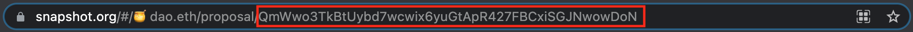

# How to check the transactions hash of a proposal

## Setup

Clone this repository with `git clone <repository-url>` and install the dependencies with `yarn`.

## Check Proposal Hashes

Go to the Snapshot space where the proposal was published. The URL of the proposal in the browser's address bar should be of the form `https://snapshot.org/#/<space-name>.eth/proposal/<proposal-id>`, similar to the example shown below.



Copy and paste the proposal ID in the following command.

`yarn hardhat --network <network> checkProposalHash --proposalid <proposalid>`

Then replace `<network>` with `mainnet` (or `rinkeby` if you are working on the testnet). Run it to get the transactions hash. You should see an output similar to:

```
### Proposal ####
ID: QmQ1s8FHhX2FtFGRcfbbdJmT1sU8EwPymDytsHyzFp5YoL

Batch nr: 1
Array of transactions hashes: [
  '0x92c17af389807d6952e9603881bf20354413812f1aeb73fe9c40292da310c9a9',
  '0x24465bf96a8e8a179d2278fbd53687d305462fc2636b82490d0c7b115e879159'
]
Transactions array hash: 0x219dc1a87f6d6031b219e3457d7162caec3f4256aad35060253619d42d95451c
```

The `Transactions array hash` must match the one displayed on the Realitio question. If it doesn't match, it means that the transactions submitted to Realitio are not the ones voted on the Snapshot proposal.